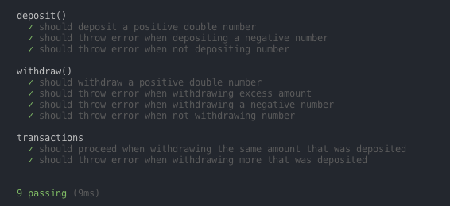

# Assignment #7 - Design by Contract

## Implementation

The `Bank.js` file implements the `withdraw` and `deposit` methods inside the `Account` class.

## Contracts

The methods implement the contracts that is described on top of the functions:

```js
  /*
    Description:
      Increase the account's balance with the given amount

    Preconditions:
    - amount must be a number (double included)
    - amount must be positive
  */
  deposit(amount) {
    (...)
  }
```

```js
  /*
    Description:
      Decrease the account's balance with the given amount.
      The balace is left untouched if the amount exceeds the balance.

    Preconditions:
    - amount must be a number (double included)
    - amount must be positive
    - amount must not exceed the balance
  */
  withdraw(amount) {
    (...)
  }
```

## Implementing the contract

The functions will first validate that the parameters received correspond to the contract. If any of the preconditions are invalid it will throw an error and not perform the transaction. This complies with the *Fail Fast* principle.

### Example from the `withdraw` method

```js
if (isNaN(amount)) { // using core function isNaN (is not a number)
  throw new Error('Amount must be a number.')
}
if (amount <= 0) {
  throw new Error('Amount must be positive.')
}
if (this.balance - amount < 0) {
  throw new Error('Balance is too low to execute the transaction.')
}
```

## Testing

The `Account` class is unit tested in the `test.js` file using `mocha` and `chai` testing and assertion libraries.

Running the test command `npm test`* will produce the following test results:



> \* must have `node` and `npm` installed on the maching

> Install dependencies before executing the tests by running the `npm install` command on the root of the project

## Choice of language

The decision to implement the Design by Contract in JavaScript was to test out the principle in a prefered programming language. In our case we basically want to validate the incoming parameters by throwing exceptions if they do not comply with the contract. The actions described in the contract are validated during testing.